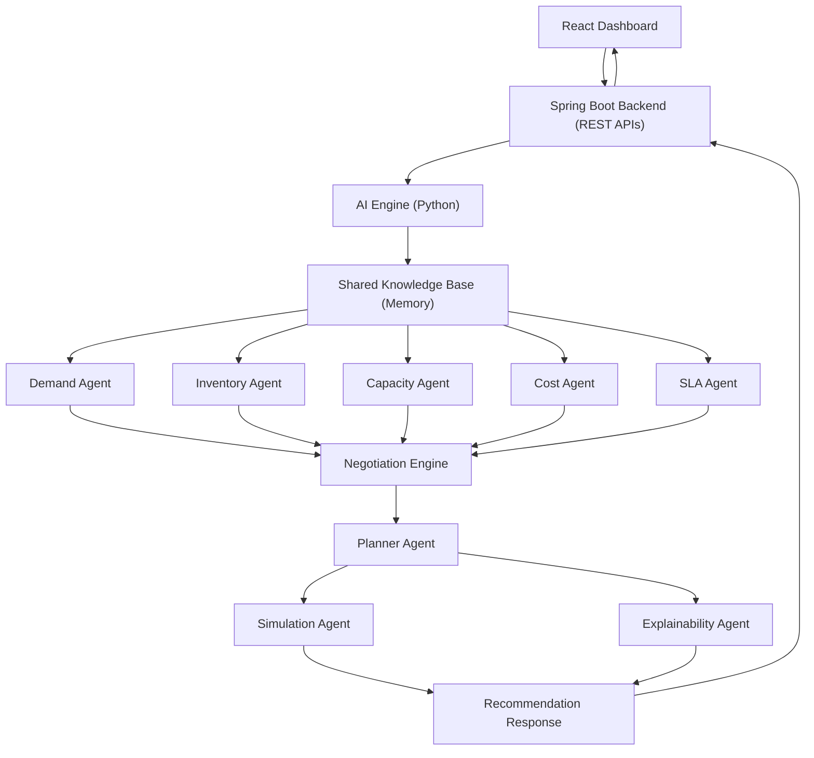

# NetworkIQ

### Multi-Agent AI Powered Retail Inventory Decision Intelligence Platform

> AI Build Hackathon 2026 Submission

---

## Overview

Modern retail supply chains operate across a vast network of warehouses, fulfillment centers, dark stores, and seller inventories. Every minute, thousands of products move through this network, making inventory placement one of the most critical business decisions.

A common challenge faced by retailers is that inventory often exists within the network but is available at the wrong location. While one warehouse may hold excess stock, another location may experience stock shortages, resulting in delayed deliveries, higher operational costs, and lost sales.

Traditional inventory management systems are primarily reactive—they respond only after stock levels fall below predefined thresholds.

NetworkIQ introduces a proactive, AI-driven approach that continuously analyzes demand patterns, inventory availability, warehouse capacity, operational costs, and delivery commitments before recommending the most optimal inventory movement strategy across the retail network.

Rather than optimizing individual warehouses, NetworkIQ performs network-wide decision intelligence, enabling retailers to reduce stockouts, improve serviceability, and optimize inventory utilization.

---

# Problem Statement

Retail inventory optimization is no longer limited to replenishing stock after shortages occur. Modern supply chains require intelligent systems capable of predicting future demand, identifying potential inventory risks, and recommending the most effective stock movement strategies across multiple locations.

The objective of NetworkIQ is to answer critical business questions such as:

- Which products are expected to experience demand spikes?
- Which locations are likely to face inventory shortages?
- Where is excess inventory available across the network?
- Should inventory be transferred or replenished?
- How can operational costs be minimized without affecting delivery commitments?
- Which recommendation provides the highest overall business value?

Instead of making isolated warehouse-level decisions, NetworkIQ analyzes the entire fulfillment network and recommends inventory transfers that balance demand, capacity, cost, and service-level commitments.

---

# Our Solution

NetworkIQ is a Multi-Agent AI Decision Intelligence Platform designed to assist inventory planners in making proactive and explainable supply chain decisions.

Rather than relying on a single AI model, the platform distributes intelligence across multiple specialized AI agents. Each agent focuses on one business objective, allowing the system to analyze the problem from different perspectives simultaneously.

The recommendations generated by individual agents are consolidated through a Negotiation Engine, coordinated by a Planner Agent, validated using simulation, and finally explained through an Explainability Agent before being presented to the planner for approval.

This collaborative approach enables smarter inventory decisions while maintaining transparency and human oversight throughout the decision-making process.

---

# Why Multi-Agent AI?

Inventory optimization is a multi-objective problem where several business constraints must be considered simultaneously.

For example:

- Demand forecasting may recommend increasing inventory.
- Capacity limitations may restrict available storage.
- Cost optimization may discourage unnecessary transfers.
- Delivery SLAs may prioritize faster replenishment.
- Inventory availability may require stock movement from another location.

Instead of allowing one large AI model to make every decision, NetworkIQ assigns each responsibility to an independent AI agent.

These agents collaborate, negotiate conflicting objectives, and collectively generate a balanced recommendation that aligns with business goals.

This architecture improves:

- Decision Quality
- Explainability
- Scalability
- Maintainability
- Business Transparency

---

# System Architecture

---

# Data & Decision Flow
```text
Customer Orders
        │
        ▼
Sales Dataset + Inventory Dataset
        │
        ▼
Spring Boot Backend
        │
        ▼
AI Engine (Python)
        │
        ▼
Shared Knowledge Base (Memory)
        │
        ▼
Planner Agent
        │
        ▼
Demand Agent
        │
        ▼
Inventory Agent
        │
        ▼
Capacity Agent
        │
        ▼
Cost Agent
        │
        ▼
SLA Agent
        │
        ▼
Negotiation Engine
        │
        ▼
Planner Agent
        │
        ▼
Simulation Agent
        │
        ▼
Explainability Agent
        │
        ▼
Recommendation Response
        │
        ▼
Spring Boot Backend
        │
        ▼
React Dashboard
        │
        ▼
Planner Approval
        │
        ▼
Inventory Updated
```
---

# Multi-Agent Decision Intelligence Layer

NetworkIQ distributes decision-making responsibilities across multiple specialized AI agents.

Each agent independently evaluates a specific business objective and contributes its recommendation to the overall optimization process.

## Demand Agent

Analyzes historical sales patterns and predicts future demand for every SKU.

Responsibilities

- Demand Forecasting
- Trend Analysis
- Demand Spike Detection
- Future Stock Risk Prediction

---

## Inventory Agent

Continuously monitors inventory availability across the retail network.

Responsibilities

- Current Stock Analysis
- Inventory Gap Detection
- Reorder Deficit Calculation
- Inventory Health Monitoring

---

## Capacity Agent

Validates warehouse and store capacity constraints before approving stock transfers.

Responsibilities

- Storage Availability
- Warehouse Capacity Validation
- Shelf Space Analysis

---

## Cost Agent

Evaluates financial impact before inventory movement.

Responsibilities

- Holding Cost Analysis
- Transfer Cost Calculation
- Procurement Cost Evaluation
- Profitability Assessment

---

## SLA Agent

Ensures delivery commitments remain satisfied after inventory movement.

Responsibilities

- Lead Time Validation
- Delivery Promise Analysis
- Serviceability Verification
- SLA Compliance

---

## Negotiation Engine

The Negotiation Engine acts as the collaborative reasoning layer of the platform.

Rather than executing recommendations independently, it gathers outputs from all AI agents, resolves conflicting objectives, and determines the most balanced inventory strategy.

---

## Planner Agent

The Planner Agent orchestrates the complete AI workflow.

It coordinates all specialized agents, manages the reasoning pipeline, and prepares the final execution strategy.

---

## Simulation Agent

Before execution, every recommendation is evaluated under simulated business scenarios to estimate its impact.

Examples include:

- Demand Surges
- Inventory Shortages
- Capacity Constraints
- Cost Variations

---

## Explainability Agent

Every recommendation generated by NetworkIQ is accompanied by a detailed explanation describing why the recommendation was selected.

Example:

Transfer 180 Units

Reason

✓ Predicted demand exceeds available inventory

✓ Destination warehouse has available capacity

✓ Transfer cost is within acceptable threshold

✓ Delivery SLA remains satisfied

Confidence Score : 95%

---

# Technology Stack
| Layer | Technologies |
|--------|--------------|
| Frontend | React.js, Vite, JavaScript |
| Backend | Spring Boot, Spring Data JPA |
| AI Engine | Python, FastAPI |
| Machine Learning | Scikit-learn |
| Database | MySQL |
| API Communication | REST APIs |
| Version Control | Git & GitHub |

---

# Project Structure
```text
NetworkIQ/
│
├── frontend/
│
├── backend/
│
├── ai-engine/
│   ├── agents/
│   ├── api/
│   ├── knowledge/
│   ├── memory/
│   ├── models/
│   ├── negotiation/
│   ├── preprocessing/
│   ├── prompts/
│   └── app.py
│
├── store_sales_data.csv
├── supply_chain_dataset1.csv
│
└── README.md
```
---

# Key Features

- Multi-Agent AI Architecture
- Network-Level Inventory Optimization
- Intelligent Demand Forecasting
- Inventory Gap Detection
- Capacity Validation
- Cost Optimization
- SLA Compliance Analysis
- Negotiation-Based Decision Making
- Business Impact Simulation
- Explainable AI Recommendations
- Human-in-the-Loop Approval
- Interactive React Dashboard

---

# Expected Business Impact

NetworkIQ is designed to deliver measurable improvements across retail supply chain operations.

The platform aims to:

- Improve product availability across the retail network
- Reduce stockouts before they occur
- Minimize unnecessary inventory transfers
- Lower warehouse holding costs
- Improve inventory utilization
- Increase fulfillment efficiency
- Support faster and more informed planning decisions
- Provide transparent and explainable AI recommendations

---

# Future Enhancements

- Live ERP & Warehouse Management System Integration
- Real-Time IoT Inventory Monitoring
- Weather-Aware Demand Forecasting
- Festival & Seasonal Demand Intelligence
- Reinforcement Learning Based Inventory Optimization
- Autonomous Warehouse Coordination
- Real-Time Supply Chain Monitoring
- Digital Twin Simulation for Inventory Planning

---

# Team Roles

| Member | Responsibility |
|---------|---------------|
| Member 1 | Data Cleaning, Feature Engineering & Machine Learning Models |
| Member 2 | AI Engine, Multi-Agent Logic & Negotiation Engine |
| Member 3 | Spring Boot Backend, React Dashboard, API Integration & Documentation |

---

# Conclusion

NetworkIQ is more than an inventory management application—it is a decision intelligence platform built to support proactive, explainable, and business-aware inventory optimization.

By combining machine learning, multi-agent collaboration, simulation, and enterprise software architecture, the platform enables retailers to make faster, smarter, and more transparent inventory decisions across their entire fulfillment network.

Instead of reacting to inventory shortages after they occur, NetworkIQ empowers planners to anticipate future demand, evaluate multiple business constraints, and confidently approve optimized inventory strategies backed by AI-driven insights.

---
